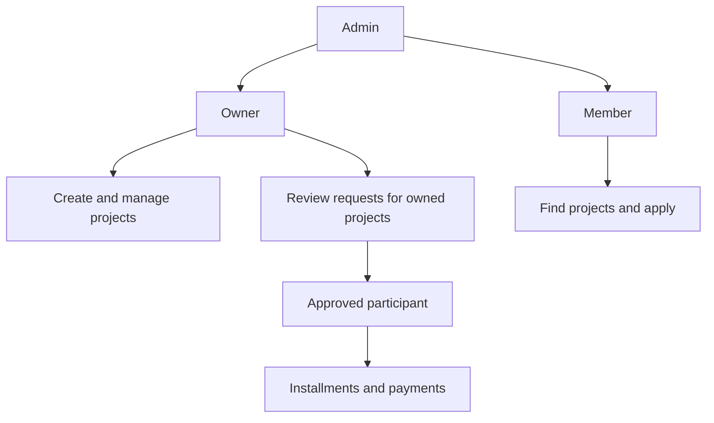

# Housing AI

Housing AI is an academic prototype for managing cooperative and pre-sale
construction projects. It connects project management, membership requests,
installment payments, project finance dashboards and explainable machine
learning in one demonstrable system.

This repository is designed for a university project and a complete local
demo. It is not a production banking or payment platform.

## What the system demonstrates

- Construction project creation and owner-scoped project management
- Three separate actors: `ADMIN`, `OWNER` and `MEMBER`
- Member registration without manual project assignment
- Available-project cards and a membership-request workflow
- Owner approval or rejection of membership requests
- Project participants, installment plans and payment rounds
- Server-side payment validation, late-payment status and penalties
- Member risk, project-delay and economic forecasting prototypes
- Property Estimation inside the Projects page
- Admin-only permanent member deletion with dependent-record cleanup

## Actor model



### Admin

The Admin has a platform-wide view of projects, users, participants, payments
and prediction tools. Admin can permanently delete a Member from the Users
page. Membership approval itself belongs to the Owner of the selected project.

### Owner

An Owner sees only assigned projects and their members. The Owner can create
projects, configure payment rounds, review membership requests, accept or
reject applicants, manage payments and use Property Estimation from Projects.

### Member

The Member has an independent dashboard rather than the Owner dashboard. A
Member can view their profile, browse available project cards, open project
details, submit an application, see approval status and view the payment
schedule after approval.

## Membership flow

1. A user selects `Owner` or `Member` during account creation.
2. Registration stores the selected role and does not contain a project selector.
3. A Member opens an available project and selects **Apply**.
4. The backend creates a `MembershipRequest` with status `PENDING`.
5. The project Owner reviews the request and the transparent risk snapshot.
6. The Owner accepts or rejects the request.
7. Approval creates a `ProjectParticipant` and enables the Member's project and
   payment views.

The API validates Iranian phone numbers in both the UI and backend. Accepted
examples are `09123456789` and `+989123456789`; a ten-digit number is rejected.

## Payment rules

Payment calculations are owned by the backend. The frontend only displays the
server response.

- The Owner chooses the total installment count when the first payment round
  is created; the count is locked after the plan starts.
- A payment round cannot be generated beyond that project limit.
- Statuses include `installment`, `paid`, `paid_late`, `overdue`, `unpaid` and
  `penalty`.
- The late fee is 2% of the original unpaid installment principal per overdue
  calendar month. It is calculated per installment and is not compounded.
- Partial payment and arbitrary overpayment are rejected in this MVP.
- Extra money is accepted only as complete future-installment prepayment.
- An Owner-defined extra cost is shown as:

  ```text
  Final Amount = Base Installment + Extra Cost Share + Penalty
  ```

## Property Estimation

Property Estimation is an embedded tool in the Projects page. It is available
to Admin and Owner accounts and is not a separate sidebar module.

### Single property estimation

Inputs include city, neighborhood, area, building age, rooms, floor, elevator,
parking, storage and property condition. The response includes total estimated
price, approximate price per square metre, a minimum/maximum range, confidence
and influential factors.

### Construction-project estimation

The project mode accepts city, neighborhood, unit count, average unit area,
optional total area and building type. It first estimates the market price per
square metre and then calculates:

```text
Estimated project value = Total area × Predicted price per m²
Estimated value per unit = Estimated project value ÷ Number of units
```

The valuation service uses the existing `property_listings` dataset, historical
`inflation_factor` values, the latest imported Housing CPI (or General CPI as a
fallback), and a small deterministic Random Forest. Controlled synthetic
perturbations broaden demo scenarios without being stored in the database. If
a neighborhood has fewer than eight direct listings, the service uses a
Tehran-wide fallback and lowers confidence. The result is a market estimate,
not a guaranteed transaction price.

Relevant endpoints:

```text
POST /ml/valuation/property
POST /ml/valuation/project
```

## Technology stack

| Layer | Technologies |
| --- | --- |
| Frontend | React 18, Vite, React Router, Axios, Lucide icons |
| Backend | Python, FastAPI, Uvicorn, SQLAlchemy, Pydantic |
| Database | Microsoft SQL Server via `pyodbc` |
| ML/data | scikit-learn, Pandas, NumPy, Joblib |
| Evaluation | Python evaluation scripts, unittest/pytest quality gates |

## Repository structure

```text
Housing-Ai-System/
├── backend/
│   ├── app/
│   │   ├── models/       # SQLAlchemy entities
│   │   ├── schemas/      # Pydantic request/response contracts
│   │   ├── routes/       # HTTP endpoints
│   │   ├── services/     # Business and ML service logic
│   │   ├── scripts/      # Import, seed, train and evaluation scripts
│   │   └── ml_docs/      # ML provenance and audit notes
│   ├── data/             # Demo datasets and property listings
│   ├── models/           # Persisted ML artifacts
│   ├── tests/
│   ├── .env.example
│   └── requirements.txt
├── frontend/
│   ├── src/
│   ├── public/
│   ├── .env.example
│   ├── package.json
│   └── package-lock.json
├── evaluation/
│   ├── ACCEPTANCE_TESTS.md
│   ├── AI_VALUATION.md
│   ├── MEMBER_PANEL_UPDATE.md
│   └── ML_EVALUATION_REPORT.md
└── README.md
```

## Prerequisites

Install the following before running the full demo:

- Python 3.11 or newer. The committed scikit-learn 1.8.0 model artifacts
  require Python 3.11+.
- Node.js 18 or newer and npm. The validation environment used Node.js
  24.18.0 with npm 11.16.0.
- Microsoft SQL Server (local installation or a reachable server)
- Microsoft ODBC Driver 18 for SQL Server

Linux/WSL needs both the `unixodbc` system package and Microsoft's
`msodbcsql18` package. Installing only the Python `pyodbc` package is not
enough; without `unixodbc`, `import pyodbc` fails with
`libodbc.so.2: cannot open shared object file`.

Create the database in SQL Server before starting the backend (for example, in
SSMS or `sqlcmd`):

```sql
CREATE DATABASE HousingAI;
```

The application and seed scripts call SQLAlchemy `create_all`, which creates
tables, but `create_all` does not create the SQL Server database itself.

## Backend setup

All backend commands below must be run from the `backend/` directory. This is
important because the import scripts use the relative paths
`data/economic_indicators.csv` and `data/tehran_properties.xlsx`.

### Windows PowerShell

```powershell
cd backend
python -m venv .venv
.\.venv\Scripts\Activate.ps1
python -m pip install -r requirements.txt
Copy-Item .env.example .env
```

### Linux/WSL

```bash
cd backend
python3 -m venv .venv
source .venv/bin/activate
python -m pip install -r requirements.txt
cp .env.example .env
```

Edit `backend/.env` for the SQL Server installation. The settings are:

| Variable | Meaning | Example |
| --- | --- | --- |
| `APP_NAME` | API title | `Housing AI API` |
| `APP_VERSION` | API version | `1.0.0` |
| `DATABASE_SERVER` | SQL Server host/instance | `localhost` |
| `DATABASE_NAME` | Existing database name | `HousingAI` |
| `DATABASE_DRIVER` | ODBC driver name | `ODBC Driver 18 for SQL Server` |
| `DATABASE_TRUSTED_CONNECTION` | `yes` for integrated auth | `yes` |
| `DATABASE_USERNAME` | SQL login when trusted auth is off | optional |
| `DATABASE_PASSWORD` | SQL login password | optional |
| `SQL_ECHO` | Print SQL statements (`true`/`false`) | `false` |

For SQL authentication, set `DATABASE_TRUSTED_CONNECTION=no` and provide
`DATABASE_USERNAME` and `DATABASE_PASSWORD`. Keep `SQL_ECHO=false` for a quiet
demo; set it to `true` only when SQL debugging is needed.

Start the API from the `backend/` directory:

```bash
uvicorn app.main:app --reload
```

The API is available at `http://127.0.0.1:8000`. Interactive documentation is
available at `http://127.0.0.1:8000/docs`; the health endpoint is
`http://127.0.0.1:8000/health`.

## Dataset import

Run both commands from `backend/` after the database exists:

```bash
python -m app.scripts.import_property_excel
python -m app.scripts.import_economic_indicators
```

`import_property_excel` reads `data/tehran_properties.xlsx` and
`import_economic_indicators` reads `data/economic_indicators.csv`; neither
command should be run from the repository root.

## Demo seed order and accounts

Run the seed commands from `backend/` in exactly this order:

| Order | Command | Depends on | Why this order matters |
| --- | --- | --- | --- |
| 1 | `python -m app.scripts.seed_demo_projects` | SQL Server database, property workbook, frontend neighborhood list | Creates the four named projects and verifies market neighborhoods. |
| 2 | `python -m app.scripts.seed_project_owners` | The four project names | The owner seed looks projects up by name and assigns one owner per project. |
| 3 | `python -m app.scripts.seed_demo_users_participants` | The four project names and owner-independent project rows | The member seed uses the names for its five-entry payment-behaviour mixes and assigns 20 members round-robin. |

```bash
cd backend
python -m app.scripts.seed_demo_projects
python -m app.scripts.seed_project_owners
python -m app.scripts.seed_demo_users_participants
```

`seed_demo_projects` is idempotent: it reuses a project with a matching name,
does not modify existing rows, and warns if an existing project has fewer than
five units. The other two seeds are also designed for repeated demo setup.

The seeded demo credentials are:

| Actor | Username | Password | Project |
| --- | --- | --- | --- |
| Admin | `admin` | `admin` | Platform-wide demo access |
| Member | `member` | `1234` | Member dashboard |
| Owner | `armin` | `1234` | Niavaran Sapphire Residences |
| Owner | `sara` | `1234` | Saadat Abad Negin Tower |
| Owner | `kaveh` | `1234` | Mehr Housing Tower Phase 3 |
| Owner | `neda` | `1234` | Shahrak Omid Apartment |

These credentials are for the local academic demo only. Login requires the
backend; the frontend does not fabricate an offline session.

## Frontend setup

Open a second terminal in the `frontend/` directory:

```bash
cd frontend
npm ci
```

The frontend setting is:

| Variable | Meaning | Example |
| --- | --- | --- |
| `VITE_API_BASE_URL` | FastAPI base URL | `http://127.0.0.1:8000` |

The default is `http://127.0.0.1:8000`. To change it, copy
`frontend/.env.example` to `frontend/.env` and edit `VITE_API_BASE_URL`.

Start the development server:

```bash
npm run dev
```

Open the URL printed by Vite, normally `http://localhost:5173`.

Before delivery, run the frontend quality checks:

```bash
npm run lint
npm run build
```

Delete `frontend/dist/` after a build when returning to a clean development
working tree. `npm run preview` serves the generated production build locally.

## Recommended demo scenario

1. Start SQL Server and the FastAPI backend.
2. Start the Vite frontend.
3. Log in as `admin / admin` and verify Projects, Users and Predictions.
4. In Create Account, select **Owner**, create an account and verify the Owner
   Dashboard.
5. In Create Account, select **Member**, create an account and verify the
   independent Member Dashboard.
6. As Member, open an available project, view its details and select Apply.
7. Log in as that project's Owner, open Membership Requests and Accept the
   pending request.
8. Return to the Member account and verify the approved project and My Payments.
9. As Admin or Owner, open Projects and run both Property Estimation modes.

## Tests and evaluation

Run backend tests from `backend/`:

```bash
python -m unittest discover -s tests -v
```

The same release gate can also be run with pytest:

```bash
python -m pytest -q
```

The same two commands are the release gate in a clean virtual environment
created from `backend/requirements.txt` only:

```bash
python -m venv .venv-clean
source .venv-clean/bin/activate  # Windows: .venv-clean\Scripts\activate
python -m pip install -r requirements.txt
python -m pytest -q
python -m unittest discover -s tests -v
```

Run the reproducible ML evaluation script from `backend`:

```bash
python -m app.scripts.evaluate_ml_accuracy
```

The acceptance checklist and methodology notes are in:

- `evaluation/ACCEPTANCE_TESTS.md`
- `evaluation/AI_VALUATION.md`
- `evaluation/ML_EVALUATION_REPORT.md`
- `backend/app/ml_docs/DATA_PROVENANCE_NOTE.md`
- `backend/app/ml_docs/ML_AUDIT_REPORT.md`

## Troubleshooting

### `pyodbc` or SQL Server connection errors

Confirm that SQL Server is running, the `HousingAI` database exists, the ODBC
Driver 18 is installed, and the values in `backend/.env` match the server. For
a named SQL Server instance, use the server name expected by that installation,
for example `localhost\SQLEXPRESS`.

### `ModuleNotFoundError: No module named 'app'`

Run Uvicorn and module-based scripts from inside the `backend` directory, not
from the repository root.

### Frontend cannot reach the API

Keep the backend running on port 8000 or set the matching value in
`frontend/.env`:

```dotenv
VITE_API_BASE_URL=http://127.0.0.1:8000
```

The frontend has no offline login fallback. Accounts, membership approval,
payments and ML responses require the backend and database.

## Scope and limitations

Housing AI intentionally stays within an undergraduate-project scope. It does
not include a real payment gateway, chat, a full notification system,
blockchain, a unit marketplace or unjustified deep-learning models.

The Member-risk and project-delay datasets are synthetic demo scenarios. The
economic module uses imported macroeconomic indicators with limited coverage.
Property Estimation combines available real listing evidence with controlled
synthetic scenarios and is a market estimate rather than a guaranteed price.

For production use, the system would still need server-side authentication and
RBAC hardening, formal migrations, `Decimal`/`NUMERIC` money storage, audit logs,
concurrency controls, monitoring and validation against real-world labelled
data.

## License

This repository is prepared as an educational/demo project. Add the license
required by your university or project supervisor before publishing it as an
open-source package.
